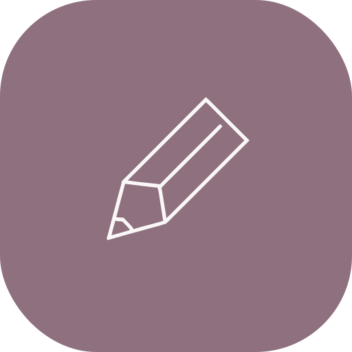
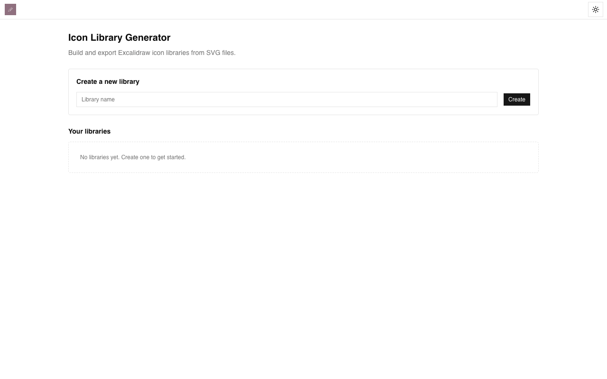
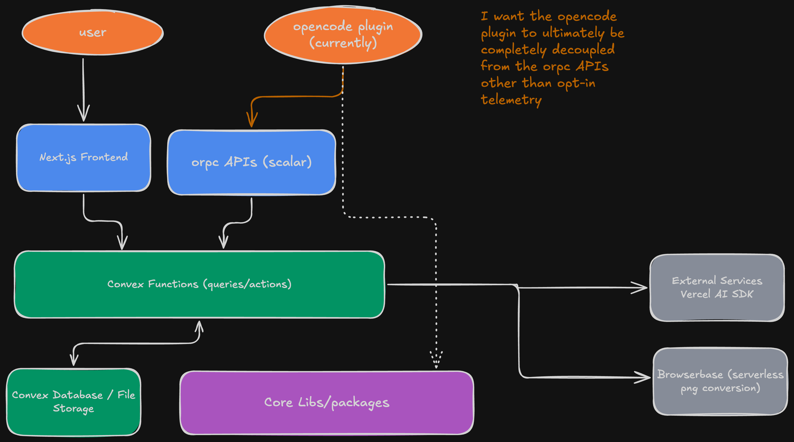

# Sketchi

<p align="center">
  
</p>

<!-- Core Stack -->
[](https://nextjs.org/docs)
[](https://react.dev/)
[](https://www.typescriptlang.org/docs/)
[](https://zod.dev/)
[](https://docs.convex.dev/)
[](https://tailwindcss.com/docs)

<!-- Tooling -->
[](https://turbo.build/repo/docs)
[](https://github.com/AmanVarshney01/create-better-t-stack)
[](https://bun.sh/docs)
[](https://biomejs.dev/guides/getting-started/)
[](https://github.com/opencode-ai/opencode)
[](https://duckdb.org/)

<!-- AI Stack -->
[](https://sdk.vercel.ai/docs)
[](https://openrouter.ai/docs)

<!-- Drawing Libraries -->
[](https://docs.excalidraw.com/)
[](https://github.com/nickreese/svg2roughjs)
[](https://github.com/dagrejs/dagre/wiki)

<!-- Testing & CI/CD -->
[](https://docs.stagehand.dev/)
[](https://docs.browserbase.com/)
[](https://github.com/ovh/venom)
[](https://playwright.dev/docs/intro)
[](https://vitest.dev/guide/)
[](https://docs.github.com/en/actions)

<!-- Deployment & License -->
[](https://sketchi.app/)
[](LICENSE)

---

## What is Sketchi?

**Sketchi** is a diagram and icon library toolkit that transforms SVGs into hand-drawn Excalidraw assets. Build icon libraries, generate AI-powered diagrams, and export production-ready `.excalidrawlib` files.

**Key Features:**
- **Icon Library Generator** - Upload SVGs, customize styles, export as Excalidraw libraries
- **AI Diagram Generation** - Convert natural language to flowcharts, architecture diagrams, and more
- **Hand-drawn Rendering** - Apply sketchy, hand-drawn aesthetics to any SVG
- **Real-time Collaboration** - Powered by Convex for instant sync

**Live at:** [https://sketchi.app/](https://sketchi.app/)

---

## Screenshots

<p align="center">
  
  <br />
  <em>Home - Tool selection dashboard</em>
</p>

<p align="center">
  
  <br />
  <em>Icon Library Generator - Build and export Excalidraw libraries</em>
</p>

---

## Table of Contents

- [What is Sketchi?](#what-is-sketchi)
- [Screenshots](#screenshots)
- [Architecture](#architecture)
- [Features](#features)
- [Quick Start](#quick-start)
- [Development](#development)
- [Testing](#testing)
- [Project Structure](#project-structure)
- [License](#license)

---

## Architecture

<p align="center">
  
  <br />
  <em>Architecture - System design and data flow</em>
</p>

**Monorepo Structure:**

| Directory | Purpose |
|-----------|---------|
| `apps/web` | Next.js 16 frontend with React 19 |
| `packages/backend` | Convex functions, actions, and database schema |
| `packages/env` | Shared environment variable validation |
| `packages/config` | Shared TypeScript configuration |
| `tests/e2e` | End-to-end tests with Stagehand |

**Data Flow:**
1. User interacts with the Next.js frontend
2. Frontend calls Convex functions via React hooks (`useQuery`, `useMutation`)
3. Convex functions handle business logic, AI calls, and database operations
4. File uploads stored in Convex storage, metadata in Convex database
5. AI diagram generation uses Vercel AI SDK through Convex actions

---

## Features

### Icon Library Generator
- **SVG Upload** - Drag and drop or select multiple SVG files
- **Style Customization** - Adjust stroke color, fill style, roughness, and opacity
- **Hand-drawn Conversion** - Transform clean SVGs into sketchy, hand-drawn versions
- **Excalidraw Export** - Download as `.excalidrawlib` for direct import

### AI Diagram Generation
- **Natural Language Input** - Describe your diagram in plain English
- **Multiple Chart Types** - Flowcharts, architecture diagrams, decision trees
- **Intermediate Format** - Structured JSON representation for predictable layouts
- **Auto Layout** - Dagre-based automatic node positioning

### Export Options
- **PNG Export** - High-resolution PNG via Browserbase rendering
- **Excalidraw Library** - Reusable icon sets for Excalidraw
- **Share Links** - Generate shareable Excalidraw links

---

## Quick Start

### Prerequisites

- [Bun](https://bun.sh/) 1.3.5+
- [Convex CLI](https://docs.convex.dev/getting-started)

### Installation

```bash
# Clone the repository
git clone https://github.com/anand-testcompare/sketchi.git
cd sketchi

# Install dependencies
bun install

# Set up Convex (follow prompts to create/link project)
bun run dev:setup

# Start development servers
bun run dev
```

The app will be available at [http://localhost:3001](http://localhost:3001).

### Environment Variables

Create `.env.local` in `apps/web/`:

```bash
NEXT_PUBLIC_CONVEX_URL=<your-convex-deployment-url>
```

For AI features and testing, see `.env.e2e.example` for additional variables.

---

## OpenCode Plugin

The publishable OpenCode plugin package lives under `packages/opencode-excalidraw` and is published to npm as `@sketchi-app/opencode-excalidraw`.

The `.opencode/` folder is a dev harness (OpenCode web UI + parquet logging) that loads the plugin from source and calls the centralized API by default (`https://sketchi.app`).

Notes:
- OpenCode runs `bun install` in `.opencode`, but you still need Playwright browsers once per machine:
  - `bunx playwright install`
- PNG outputs default to `./sketchi/png` in the directory where OpenCode is run.
- Override API base with `SKETCHI_API_URL`.
- Tools exposed: `diagram_from_prompt`, `diagram_tweak`, `diagram_restructure`, `diagram_to_png`, `diagram_grade`.
- Start OpenCode web UI + event logging: `bun run opencode:serve` (logs to `./sketchi/opencode-logs/*.parquet`).
- DuckDB example (explicit column list, newest log file):
```bash
# Run at least once to generate logs: bun run opencode:serve
duckdb -c "SELECT receivedAt, directory, eventType, eventStream, sessionID, messageID, parentMessageID, partID, partType, kind, toolName, toolStatus, toolCallID, toolStartMs, toolEndMs, toolDurationMs, role, providerID, modelID, messageCreatedMs, messageCompletedMs, stepCost, stepStartMs, stepEndMs, stepDurationMs, tokensInput, tokensOutput, tokensReasoning, tokensCacheRead, tokensCacheWrite, traceId, data FROM read_parquet('$(ls -t sketchi/opencode-logs/*.parquet | head -n 1)') ORDER BY receivedAt DESC LIMIT 200;"
```

---

## Development

### Commands

| Command | Description |
|---------|-------------|
| `bun run dev` | Start all apps (frontend + Convex) |
| `bun run dev:web` | Start frontend only |
| `bun run dev:server` | Start Convex backend only |
| `bun run build` | Build all apps |
| `bun run check-types` | TypeScript type checking |
| `bun x ultracite fix` | Format code with Biome |
| `bun x ultracite check` | Lint check with Biome |

### Code Quality

This project uses **Ultracite** (Biome preset) for formatting and linting:

```bash
# Format and fix issues
bun x ultracite fix

# Check for issues
bun x ultracite check
```

---

## Testing

Sketchi follows a **test hierarchy**: API tests > E2E tests > unit tests (last resort).

### API Tests (Convex Functions)

Located in `packages/backend/convex/*.test.ts`. Uses Vitest + convex-test.

```bash
# Run all Convex tests
cd packages/backend
bun run test

# Watch mode
bun run test:watch

# Generate report
bun run test:report
```

**Test files:**
- `visualGrading.test.ts` - Vision-based diagram grading
- `export.test.ts` - PNG export via Browserbase
- `diagramGenerateFromIntermediate.test.ts` - Diagram rendering
- `diagramLayout.test.ts` - Auto-layout algorithms
- `arrowOptimization.test.ts` - Arrow path optimization

### E2E Tests (Stagehand + Playwright)

Located in `tests/e2e/`. Uses Stagehand 3 with LLM-based visual grading.

```bash
# Set up environment
cp tests/e2e/.env.example tests/e2e/.env.e2e
# Fill in OPENROUTER_API_KEY, BROWSERBASE_API_KEY, etc.

# Run scenario
cd tests/e2e
bun run visual-sanity
```

**Scenarios:**
- `visual-sanity.ts` - Visual sweep across light/dark modes
- `icon-library-generator-happy-path.ts` - Full user flow test

### CI/CD

- **Backend tests**: Run on every PR via GitHub Actions
- **E2E tests**: Run against preview deployments
- **Reports**: Uploaded as artifacts to GitHub

---

## Project Structure

```
sketchi/
├── apps/
│   └── web/                    # Next.js 16 frontend
│       ├── src/
│       │   ├── app/            # App Router pages
│       │   ├── components/     # React components
│       │   └── lib/            # Utilities
│       └── public/             # Static assets
├── packages/
│   ├── backend/                # Convex backend
│   │   ├── convex/             # Functions, schema, tests
│   │   └── lib/                # Shared utilities
│   ├── config/                 # Shared TypeScript config
│   └── env/                    # Environment validation
├── tests/
│   └── e2e/                    # Stagehand E2E tests
├── docs/                       # Documentation
├── turbo.json                  # Turborepo config
└── package.json                # Root workspace config
```

---

## License

MIT License - see [LICENSE](LICENSE) for details.

Copyright (c) 2026 Anand Pant | shpit.dev/contact
