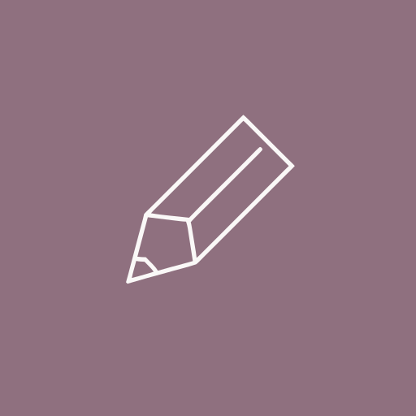
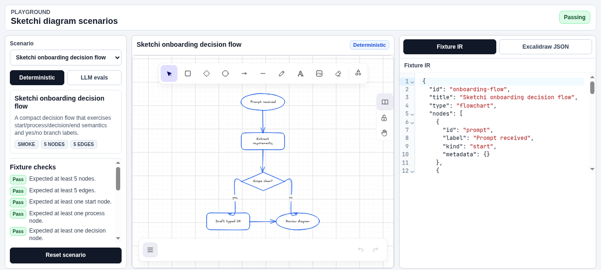

<p align="center">
  
</p>

<h1 align="center">Sketchi</h1>

<p align="center">
  <strong>Typed, deterministic diagrams for people and AI agents.</strong><br />
  Prompt to validated IR to editable Excalidraw and hosted PNG artifacts.
</p>

<p align="center">
  <a href="https://sketchi.app/"></a>
  <a href="https://nx.dev/"></a>
  <a href="https://workers.cloudflare.com/"></a>
  <a href="https://www.typescriptlang.org/"></a>
  <a href="https://excalidraw.com/"></a>
  <a href="LICENSE"></a>
</p>

---

Sketchi is the canonical Nx and Cloudflare workspace for generating reliable,
editable diagrams. Model output is never treated as a finished drawing: it is
parsed into a typed intermediate representation, validated, laid out by code,
converted to real Excalidraw elements, and persisted as an artifact with PNG and
scene representations.

<p align="center">
  
  <br />
  <em>Deterministic scenario inspection: typed IR, rendered canvas, and quality checks in one workspace.</em>
</p>

## What Sketchi Does

- Creates hosted flowcharts and mindmaps from natural-language prompts.
- Produces validated, editable Excalidraw scenes instead of opaque images.
- Exposes Code Mode through MCP and versioned HTTP artifact endpoints.
- Keeps layout, bindings, wrapping, and scene conversion deterministic in code.
- Tests diagram contracts with fixtures, maintained scenarios, real-scene
  validation, component tests, and Storybook.
- Converts a curated SVG corpus into native Excalidraw elements and libraries.

## Code Mode

Codex, Claude Code, Agy, and OpenCode can create hosted diagrams through the
public Code Mode MCP endpoint. The [agent quickstart](docs/code-mode-agent-plugins.md)
contains installation, verification, and first-diagram instructions for every
supported harness. The public flow does not require a Sketchi login, API key, or
local browser installation.

```text
prompt or revision
        ↓
model candidate → typed diagram IR → deterministic scene → Excalidraw artifact
        ↓                                      ↓                  ↓
 maintained scenarios                    validation          hosted PNG
```

## Architecture

| Boundary                      | Responsibility                                                  |
| ----------------------------- | --------------------------------------------------------------- |
| `packages/diagram-core`       | Typed diagram contracts, semantic validation, fixtures          |
| `packages/diagram-generation` | Provider messages, responses, and candidate parsing             |
| `packages/diagram-agent`      | Canonical build runtime, quality checks, artifact orchestration |
| `packages/diagram-renderer`   | Deterministic layout and scene generation                       |
| `packages/diagram-excalidraw` | Persistable Excalidraw conversion and real-scene validation     |
| `packages/diagram-scenarios`  | Maintained prompts, assertions, and local/live evals            |
| `packages/diagram-studio-ui`  | Shared React diagram, review, and eval UI states                |
| `packages/svg-excalidraw`     | Native SVG-to-Excalidraw conversion and library serialization   |

The first high-reliability target is decision-heavy flowchart generation.
`flowchart` and `mindmap` are explicit diagram families; unsupported families do
not silently fall back to a generic template. See the full
[architecture guide](docs/architecture.md) and the
[MCP-first generation boundary](docs/mcp-first-generation.md).

## Product Surfaces

| Surface        | Role                                                               | Local command              |
| -------------- | ------------------------------------------------------------------ | -------------------------- |
| `web`          | `sketchi.app` home, docs, and setup                                | `pnpm nx dev web`          |
| `studio`       | Public Playground, Code Mode API/MCP, artifacts, Studio foundation | `pnpm nx dev studio`       |
| `icons`        | `icons.sketchi.app` curated icon browser                           | `pnpm nx dev icons`        |
| `eval-harness` | Internal scenario and model-output eval harness                    | `pnpm nx dev eval-harness` |
| `excalidraw`   | Internal real-canvas rendering and editing workspace               | `pnpm nx dev excalidraw`   |

The internal harness rename from `playground` to `eval-harness` is complete.
The current `studio` app still hosts the public Playground and Studio
foundation; that public host has not moved. Later phases remain documented in
the reviewed [repository structure proposal](docs/repository-structure-proposal.html).

## Quick Start

Prerequisites: Node.js compatible with the pinned toolchain, Corepack, and pnpm
`11.5.0`.

```sh
pnpm install
pnpm dev
```

Run one surface with `pnpm nx dev <project>`. `pnpm dev` starts every Nx app with
a `dev` target in parallel through Portless.

## Development

Required workspace proof:

```sh
pnpm nx run-many -t typecheck,test,build
pnpm nx build-storybook diagram-studio-ui
```

Run the canonical deterministic scenario:

```sh
pnpm nx scenario diagram-scenarios -- \
  --scenario pharma-batch-disposition \
  --fixture \
  --out .memory/pharma-batch.excalidraw
```

Use a local model command by setting `SKETCHI_GENERATOR_COMMAND`; it receives the
scenario prompt on stdin and writes candidate IR JSON to stdout.

Generate new owned surfaces through the workspace plugin:

```sh
pnpm nx g @sketchi/generators:ui-component StatusBadge
pnpm nx g @sketchi/generators:diagram-type mindmap --title "Sketchi mindmap fixture"
```

## Deployment

Eligible same-repository pull requests build and deploy app-specific Cloudflare
Workers when Cloudflare credentials are configured, then maintain one preview
comment per app. Relevant merges to `main` deploy production Workers when those
credentials are available; custom domain attachment remains an explicit
operator action. Forks and unconfigured environments retain build proof without
a Worker deploy. The eval harness and standalone Excalidraw workspace are
internal surfaces.

Worker builds are isolated under `dist/apps/<app>` and resolved through an
explicit Nx-project-to-Worker map, so parallel builds and later repository
renames cannot overwrite or implicitly rename durable Worker deployments.

See [preview deployments](docs/preview-deploys.md) and the guarded
[production domain runbook](docs/production-domain-cutover.md).

```sh
pnpm deploy:eval-harness
pnpm deploy:studio
pnpm deploy:web
pnpm deploy:excalidraw
pnpm deploy:icons
```

## Repository Map

```text
apps/                    Deployable TanStack Start and Storybook surfaces
packages/                Typed diagram, rendering, UI, eval, and SVG libraries
plugins/                 Codex and Claude Code distribution payloads
tools/sketchi-generators Nx generators for components and diagram families
scripts/                 Preview, production, cutover, and pipeline operations
docs/                    Architecture, product boundaries, and runbooks
```

## Documentation

- [Agent plugin quickstart](docs/code-mode-agent-plugins.md)
- [Architecture](docs/architecture.md)
- [Agentic generation](docs/agentic-generation.md)
- [MCP-first generation](docs/mcp-first-generation.md)
- [SVG conversion plan](docs/svg-excalidraw-conversion-plan.md)
- [Repository replacement record](docs/replacement.md)

## License

MIT. See [LICENSE](LICENSE).
