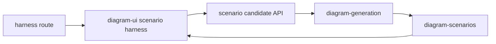

# Eval Harness

TanStack Start internal eval harness for scenario evaluation and prompt-output
inspection.



| Owns                                | Does not own                   |
| ----------------------------------- | ------------------------------ |
| scenario harness route shell        | public Sketchi Playground chat |
| local/live candidate inspection     | Code Mode MCP server           |
| app-specific Worker deployment      | core diagram contracts         |
| Cloudflare binding adapter for runs | reusable component definitions |

## Commands

```sh
pnpm nx dev eval-harness
pnpm nx test eval-harness
pnpm nx typecheck eval-harness
pnpm nx build eval-harness
pnpm nx cf-typegen eval-harness
pnpm nx deploy eval-harness
```

## Usage

Use this app to inspect maintained scenarios, paste or generate candidate IR,
and verify package behavior through a deployed app shell. It should stay a
testing ground for generation reliability rather than grow into the public
Playground or persisted Studio surface.

The Nx and private npm project identities are `eval-harness` and
`@sketchi/eval-harness`. Deployment intentionally retains the durable
`sketchi-playground` Worker, `sketchi-playground-pr-*` preview prefix,
`SKETCHI_APP_SURFACE=playground`, and `/api/scenario-candidates` contract.
