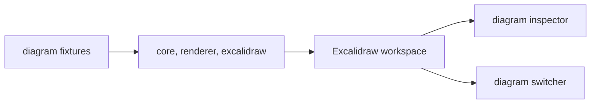

# excalidraw

No-auth Excalidraw workspace shell for inspecting real Sketchi diagram artifacts.



| Owns                              | Does not own                   |
| --------------------------------- | ------------------------------ |
| Excalidraw product shell          | generation or model calls      |
| diagram workspace UI              | shared conversion internals    |
| app-local inspector and switcher  | Studio Code Mode API routes    |
| Worker deployment for the surface | authentication or account data |

## Commands

```sh
pnpm nx dev excalidraw
pnpm nx test excalidraw
pnpm nx typecheck excalidraw
pnpm nx build excalidraw
pnpm nx storybook excalidraw
pnpm nx build-storybook excalidraw
pnpm nx deploy excalidraw
```

## Usage

Use this app when validating the actual Excalidraw experience independently of
Studio chat or Code Mode. It composes shared diagram packages and app-local
workspace UI so artifact rendering problems can be isolated from generation.
