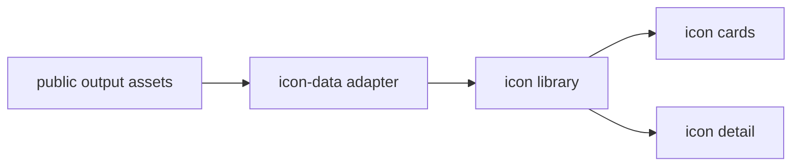

# icons

Standalone browser for curated Sketchi icon output assets.



| Owns                                | Does not own                   |
| ----------------------------------- | ------------------------------ |
| icon library browsing UI            | upstream icon collection       |
| app-local review data adapter       | normalization pipeline scripts |
| icon card and detail states         | diagram generation packages    |
| Worker deployment for icon browsing | Studio or Excalidraw surfaces  |

## Commands

```sh
pnpm nx dev icons
pnpm nx test icons
pnpm nx typecheck icons
pnpm nx build icons
pnpm nx storybook icons
pnpm nx build-storybook icons
pnpm nx deploy icons
```

## Usage

Use this app to inspect the copied, pre-cleaned icon output tree from the
Sketchi icon pipeline. Keep provider fetching, normalization, and upload
preparation outside this app boundary.
