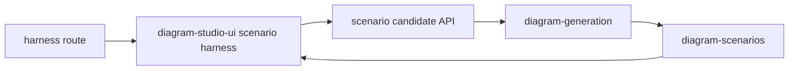

# eval harness

TanStack Start internal eval harness for scenario evaluation and prompt-output
inspection.



| Owns                                | Does not own                   |
| ----------------------------------- | ------------------------------ |
| scenario harness route shell        | public Sketchi Playground chat |
| local/live candidate inspection     | Code Mode MCP server           |
| app-specific Worker deployment      | core diagram contracts         |
| Cloudflare binding adapter for runs | reusable component definitions |

## Commands

```sh
pnpm nx dev playground
pnpm nx test playground
pnpm nx typecheck playground
pnpm nx build playground
pnpm nx deploy playground
```

## Usage

Use this app to inspect maintained scenarios, paste or generate candidate IR,
and verify package behavior through a deployed app shell. It should stay a
testing ground for generation reliability rather than grow into the public
Playground or persisted Studio surface.
