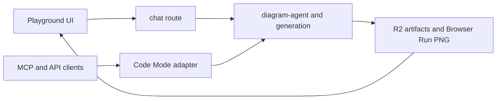

# playground

Current hosted Sketchi Playground worker boundary for ephemeral generation, Code
Mode APIs, MCP, artifacts, diagram review, artifact editor routes, and the
persisted Studio project foundation.



| Owns                                    | Does not own                         |
| --------------------------------------- | ------------------------------------ |
| Playground routes and app shell         | core IR shape or validation rules    |
| Code Mode HTTP and MCP adapters         | reusable diagram review components   |
| artifact storage and review/edit routes | global preview deploy orchestration  |
| server-side usage event scheduling      | raw Excalidraw editing as a contract |

## Commands

```sh
pnpm nx dev playground
pnpm nx test playground
pnpm nx typecheck playground
pnpm nx build playground
pnpm nx deploy playground
pnpm nx cf-typegen playground
```

## Usage

This app is the current product-facing Worker boundary for ephemeral agentic
diagram creation. It should remain a thin app adapter over shared diagram
packages while owning transport details such as MCP `execute`, hosted artifact
URLs, R2 bindings, Cloudflare Browser Run rendering, and the smallest persisted
Studio route layer. Anonymous Playground generation must not depend on Studio
project persistence.

## Playground artifact retention

Anonymous Playground handoff URLs use the same artifact store as Code Mode.
Deployed Workers write artifacts to the configured `SKETCHI_ARTIFACTS` object
bucket. Local development falls back to process memory, so local artifact URLs
survive page reloads but not dev-server restarts.

Review routes live at `/artifacts/:artifactId`; the product canvas entry lives
at `/artifacts/:artifactId/edit`. The standalone `apps/excalidraw` workspace
remains internal even though the editor capability is exposed through these
artifact routes. Reviews of patched artifacts link back to the durable source
artifact recorded in the stored manifest.

## Studio persistence foundation

Persisted Studio routes live at `/projects`, `/projects/:projectId`,
`/diagrams/:diagramId`, and `/diagrams/:diagramId/edit`. Artifact review pages
can save a Playground artifact into a Studio project without changing the
anonymous Playground flow.

Project, diagram, and owner-project membership records are JSON objects under
the `studio/` prefix in the same `SKETCHI_ARTIFACTS` object bucket that stores
generated artifact payloads. Project lists are derived by listing the owner's
membership prefix instead of rewriting one shared index object, so concurrent
saves for the same owner cannot drop each other from the list. The records point
at the durable artifact id rather than copying scene data. Local development
falls back to process memory when the Worker binding is not available.

The persistence model supports authenticated owners, but the deployed resolver
currently issues anonymous session-cookie owners until a real product auth
provider is wired. Do not trust arbitrary request headers as auth.
