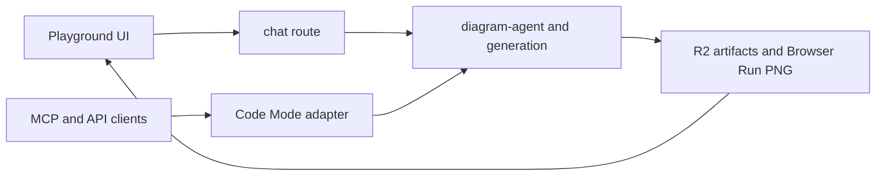

# studio

Current hosted Sketchi Playground chat surface for ephemeral generation, Code
Mode APIs, MCP, artifacts, diagram review, and artifact editor routes.



| Owns                                    | Does not own                         |
| --------------------------------------- | ------------------------------------ |
| Playground routes and app shell         | core IR shape or validation rules    |
| Code Mode HTTP and MCP adapters         | reusable diagram review components   |
| artifact storage and review/edit routes | global preview deploy orchestration  |
| server-side usage event scheduling      | raw Excalidraw editing as a contract |

## Commands

```sh
pnpm nx dev studio
pnpm nx test studio
pnpm nx typecheck studio
pnpm nx build studio
pnpm nx deploy studio
pnpm nx cf-typegen studio
```

## Usage

This app is the current product-facing Worker boundary for ephemeral agentic
diagram creation. It should remain a thin app adapter over shared diagram
packages while owning transport details such as MCP `execute`, hosted artifact
URLs, R2 bindings, and Cloudflare Browser Run rendering. Future persisted Studio
routes should build on this boundary without making the anonymous Playground
depend on full workspace persistence.

## Playground artifact retention

Anonymous Playground handoff URLs use the same artifact store as Code Mode.
Deployed Workers write artifacts to the configured `SKETCHI_ARTIFACTS` object
bucket. Local development falls back to process memory, so local artifact URLs
survive page reloads but not dev-server restarts.

Review routes live at `/artifacts/:artifactId`; the product canvas entry lives
at `/artifacts/:artifactId/edit`. The standalone `apps/excalidraw` workspace
remains internal even though the editor capability is exposed through these
artifact routes.
