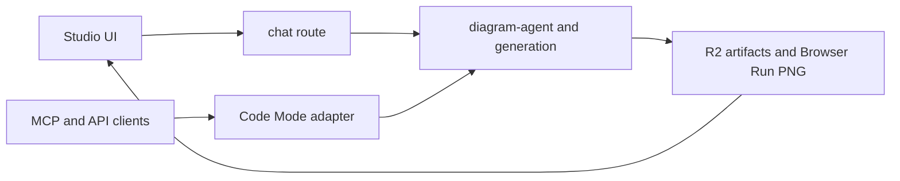

# studio

Hosted Sketchi Studio surface for chat, Code Mode APIs, MCP, artifacts, and diagram review.



| Owns                               | Does not own                         |
| ---------------------------------- | ------------------------------------ |
| Studio routes and app shell        | core IR shape or validation rules    |
| Code Mode HTTP and MCP adapters    | reusable diagram review components   |
| artifact storage and render routes | global preview deploy orchestration  |
| server-side usage event scheduling | raw Excalidraw editing as a contract |

## Commands

```sh
pnpm nx dev studio
pnpm nx test studio
pnpm nx typecheck studio
pnpm nx build studio
pnpm nx deploy studio
pnpm nx cf-typegen studio
```

## Usage

Studio is the product-facing Worker boundary for agentic diagram creation. It
should remain a thin app adapter over shared diagram packages while owning
transport details such as MCP `execute`, hosted artifact URLs, R2 bindings, and
Cloudflare Browser Run rendering.
