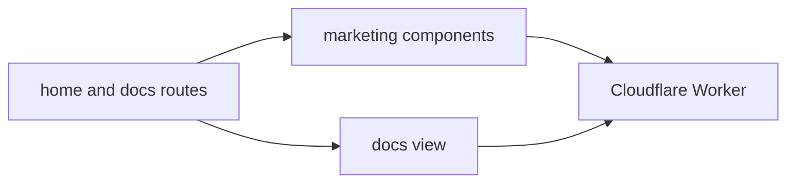

# web

Public Sketchi home and docs surface for the v2 product direction.



| Owns                            | Does not own                     |
| ------------------------------- | -------------------------------- |
| public home and docs routes     | diagram generation runtime       |
| marketing and product copy UI   | Code Mode MCP/API implementation |
| app-specific Storybook states   | artifact storage or rendering    |
| Worker deployment for `sketchi` | reusable diagram package logic   |

## Commands

```sh
pnpm nx dev web
pnpm nx test web
pnpm nx typecheck web
pnpm nx build web
pnpm nx storybook web
pnpm nx build-storybook web
pnpm nx deploy web
```

## Usage

Keep public-facing product explanation here. If docs become interactive, route
through shared packages deliberately instead of letting the marketing app own
diagram runtime behavior.
