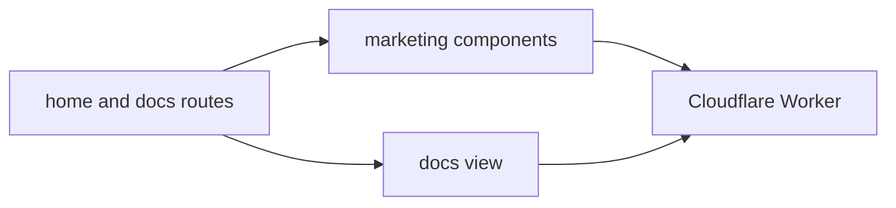

# web

Public Sketchi home and docs surface for the v2 product direction.


```mermaid
flowchart LR
  Routes["home and docs routes"] --> Marketing["marketing components"]
  Routes --> Docs["docs view"]
  Marketing --> Worker["Cloudflare Worker"]
  Docs --> Worker
```

| Owns                            | Does not own                     |
| ------------------------------- | -------------------------------- |
| public home and docs routes     | diagram generation runtime       |
| marketing and product copy UI   | Code Mode MCP/API implementation |
| app-specific Storybook states   | artifact storage or rendering    |
| Worker deployment for `sketchi` | Excalidraw nav                   |

## Commands

```sh
pnpm nx dev web
pnpm nx test web
pnpm nx typecheck web
pnpm nx build web
pnpm nx storybook web
pnpm nx build-storybook web
pnpm nx deploy web
pnpm nx run web:social-card    # redraw the link-preview card
pnpm nx run web:home-diagram   # re-export the home diagram after replacing its scene
```

## Usage

Keep public-facing product explanation here. Public navigation should point to
Sketchi Playground, Icons, docs, and setup routes, not the standalone
Excalidraw workspace. If docs become interactive, route through
shared packages deliberately instead of letting the marketing app own diagram
runtime behavior.
