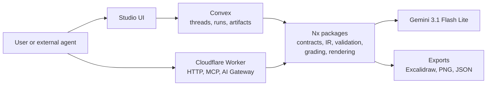
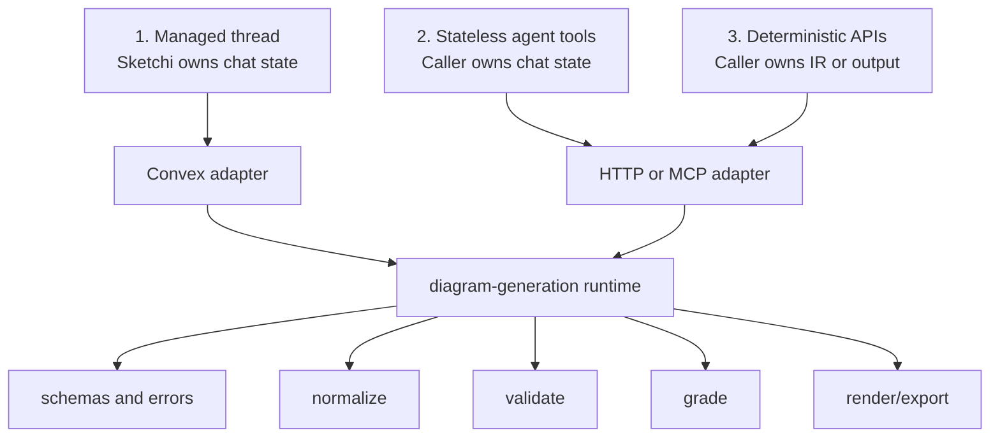
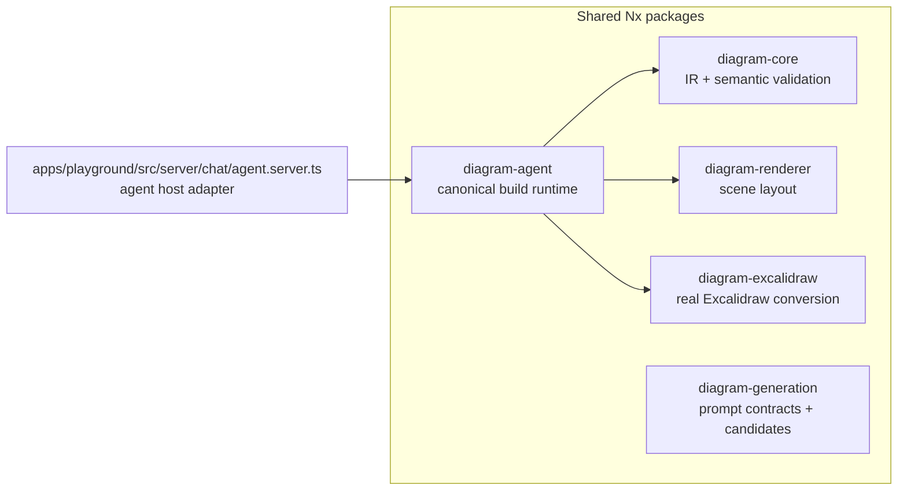
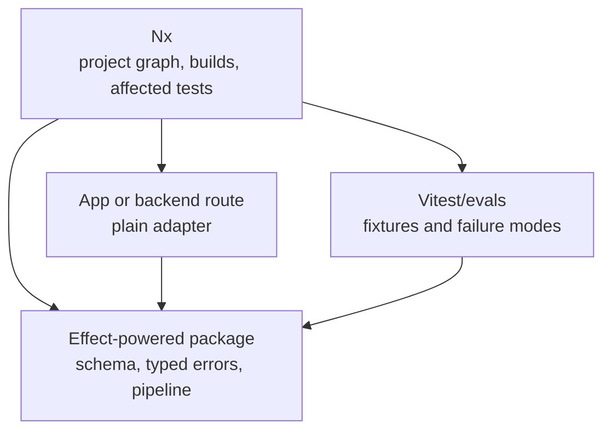
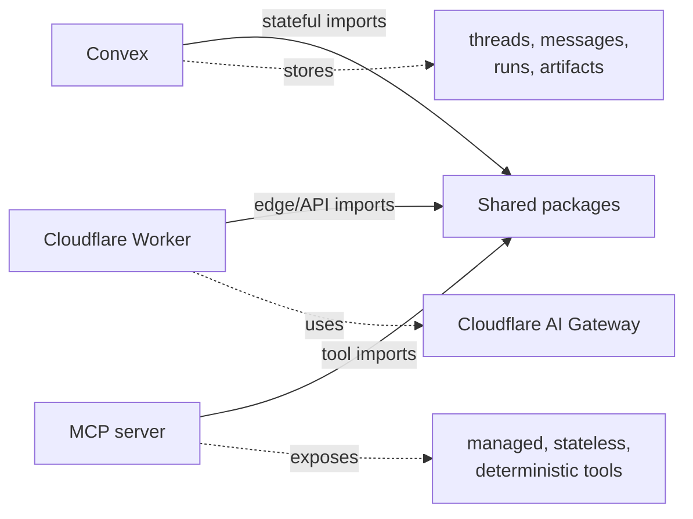
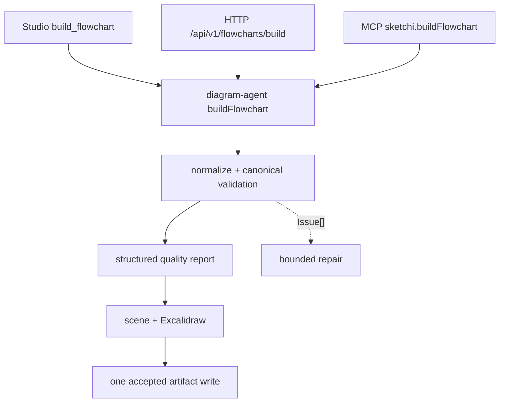

# Agentic Generation

## Decision

Keep **normal Convex** for product state. Put the valuable generation behavior in
shared Nx packages. Use **Effect inside those packages** when it improves
schemas, typed errors, and pipeline tests.

AI SDK stays narrow: chat streaming, model calls, and tool-call transport.
Gemini 3.1 Flash Lite is the only planned model path for now.



## Route Surfaces



| Surface              | Owns                                       | Example calls                                        | Best runtime                         |
| -------------------- | ------------------------------------------ | ---------------------------------------------------- | ------------------------------------ |
| Managed thread       | Messages, async progress, artifact history | `createThread`, `continueThread`, `acceptArtifact`   | Convex                               |
| Stateless agent tool | One request/response artifact build        | `buildFlowchart`, `getArtifact`, `applyDiagramPatch` | Worker, MCP, or Convex action        |
| Deterministic API    | Canonical semantic spec to artifact result | `buildFlowchart`                                     | Shared package, wrapped by any route |

## Package Shape



| Package              | Keep here                                                                        | Keep out                           |
| -------------------- | -------------------------------------------------------------------------------- | ---------------------------------- |
| `diagram-core`       | IR types, parsing, semantic validation, fixtures                                 | Model calls, storage               |
| `diagram-renderer`   | Deterministic scene model                                                        | Provider logic, user/session state |
| `diagram-excalidraw` | Excalidraw conversion and validation                                             | Chat orchestration                 |
| `diagram-generation` | Gemini request/response helpers, prompt messages, candidates                     | Durable threads                    |
| `diagram-agent`      | Canonical build contracts, normalize, grade, render/export, artifact persistence | App routes, auth, provider menus   |

## Effect + Nx

Effect and Nx do not compete.



| Question                            | Answer                                                                            |
| ----------------------------------- | --------------------------------------------------------------------------------- |
| Does Nx need special Effect config? | No. Effect is just TypeScript inside an Nx package.                               |
| What does Nx add?                   | Boundaries, imports, cacheable targets, affected checks.                          |
| What does Effect add?               | Typed pipelines, typed failures, schema-first parsing, testable retries/timeouts. |
| Where should Effect live first?     | Package boundaries where typed failures or resource ownership buy clarity.        |
| Where should it not leak yet?       | React UI, Convex schema, or Cloudflare route handlers unless that buys clarity.   |

Preferred shape:

```mermaid
sequenceDiagram
  participant Route as Convex/Worker/MCP route
  participant Adapter as Thin adapter
  participant EffectCore as Effect pipeline
  participant Store as Convex storage

  Route->>Adapter: plain args
  Adapter->>EffectCore: parse + run
  EffectCore-->>Adapter: typed success or typed failure
  Adapter->>Store: no second write; accepted build already persisted once
  Adapter-->>Route: plain JSON response
```

## Runtime Ownership



| Runtime | Good at                                                 | Should not become                      |
| ------- | ------------------------------------------------------- | -------------------------------------- |
| Convex  | Product state, auth, threads, artifacts, async progress | The only way to run generation         |
| Worker  | Public HTTP, MCP, AI Gateway, independent deploys       | The source of truth for shared logic   |
| MCP     | Agent-facing tools                                      | A parallel implementation              |
| AI SDK  | Model calls, streaming, tool-call plumbing              | Artifact contract or provider strategy |

## Canonical Build Vertical

Studio, HTTP, and MCP now converge on one non-Convex product operation.



Studio remains a thin AI SDK adapter: it injects scene/Excalidraw artifact
options, caps a model turn at three build attempts, renders canonical issues,
and consumes the accepted artifact returned by the runtime. It has no parallel
flowchart schema, evaluator, session, mapper, or persistence endpoint.

## References

- Convex Agent overview: https://docs.convex.dev/agents/overview
- Convex Agent streaming: https://docs.convex.dev/agents/streaming
- Cloudflare AI Gateway Worker binding methods:
  https://developers.cloudflare.com/changelog/post/2025-01-26-worker-binding-methods/
