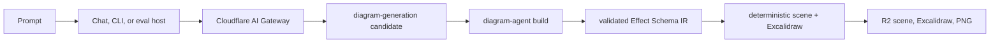

# Agentic generation

## Decision

Sketchi generation is an Effect-first Cloudflare system. Cloudflare Workers
host chat, HTTP, MCP, persistence, Browser Rendering, AI Gateway, and internal
evaluation. Shared Nx packages own the product behavior; adapters only decode,
provide a layer, run one Effect program, and encode the established contract.

There is no current Convex runtime or parallel generation implementation.

## Canonical vertical

`diagram-generation` owns model request construction, the provider service,
timeouts, retries, response decoding, and candidate diagnostics.
`diagram-agent` owns the canonical build transaction: normalization, semantic
validation, quality assessment, deterministic rendering, Excalidraw export,
Browser Rendering input, and accepted artifact persistence.

The following surfaces converge on that vertical:

| Surface        | Adapter responsibility                                  | State                                    |
| -------------- | ------------------------------------------------------- | ---------------------------------------- |
| Studio chat    | AI SDK streaming and bounded tool turns                 | accepted artifacts returned by the build |
| HTTP           | request/response and status mapping                     | R2 artifact URLs                         |
| MCP            | SDK callback and tool result mapping                    | the same R2 artifact URLs                |
| CLI `generate` | terminal options/output and local atomic record storage | local versioned records                  |
| eval harness   | scenario selection and candidate reporting              | internal evidence files                  |

No surface owns a parallel flowchart schema, repair issue model, quality
grader, renderer, or accepted-artifact writer.

## Provider routing

Worker generation uses a Cloudflare AI Gateway binding, which authenticates the
request and supplies the stored Google AI Studio provider key. The public
Sketchi generate API (`POST /api/v1/generate` on the Playground Worker) exposes
this vertical unauthenticated: prompt in; generated, validated, quality-gated
diagram and artifacts out. CLI `generate` makes one unauthenticated HTTPS call
to that endpoint and requires no token, key, account, or login; it never reads
or sends a provider credential. The six manual CLI commands (`create`, `show`,
`edit`, `list`, `restore`, and `export`) remain strictly offline; credential-free
`share` and `pull` use the pinned Excalidraw share service.

Provider boundaries retain the existing no-store policy, model and scenario
metadata, correlation fields, typed failures, bounded retries, TestClock
timeouts, and interruption forwarding.

## Effect ownership

- External capabilities are `Context.Service` contracts.
- Production and test implementations are `Layer` values.
- Business operations are named with `Effect.fn` and return typed failures.
- Effect Schema is the domain and protocol authority.
- Foreign SDK and platform Promises are adapted once at framework boundaries.
- Scope owns exporters, Browser Rendering, child processes, and cleanup.
- Interruption is never translated into an expected provider or domain error.

Pure validation, layout, geometry, transformations, and React rendering stay
plain. Effect composes them but does not wrap them for ceremony.

## Agent and Code Mode contract

The MCP Code Mode surface exposes documentation, search, and execution around
one canonical contract. The generated tool program produces a build request;
the runtime returns structured issues for bounded repair or accepted artifact
metadata. Scene, Excalidraw, and PNG URLs all refer to one artifact identity.

Chat renders those canonical issues and caps repair attempts. MCP and HTTP keep
the same issue codes, paths, hints, status mapping, and persisted formats. The
schema adapter is derived from Effect Schema instead of maintaining Zod or a
manual duplicate.

## Evaluation

`diagram-scenarios` keeps prompts and grading deterministic. Its internal CLI
can evaluate fixtures, input files, or one generator command. The command
lifecycle is a scoped Effect service: normal exit, inherited-stdio close grace,
timeout, SIGTERM, SIGKILL escalation, forced settlement, interruption, output
capture, and release are explicit and TestClock-tested.

`tools/harness-eval.ts` uses that service to drive supported external harnesses
and writes sanitized evidence under `.memory/`. These internal tools do not add
public Sketchi CLI commands.

## Proof

Generation changes preserve golden HTTP/MCP/persistence contracts and run
package tests, Storybook, packaged CLI smoke, Worker dry-runs/bundle reports,
and exact-head preview probes. Live gateway credentials and retained payloads
are never invented or logged; an unavailable privileged proof is reported as a
blocker rather than simulated.
