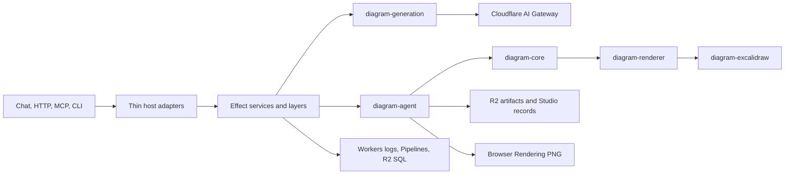

# Sketchi architecture

Sketchi is one Nx workspace deployed on Cloudflare Workers. Effect v4 is the
authoritative programming model for non-trivial I/O, concurrency, time,
resources, expected failures, and observability. Deterministic algorithms and
UI rendering remain ordinary TypeScript and React.

## Runtime map

The five Worker projects are `web`, `playground`, `eval-harness`, `excalidraw`,
and `icons`. `playground` deploys as the durable `sketchi-studio` Worker and
owns chat, HTTP build/artifact APIs, MCP, Browser Rendering, and Studio
persistence. `eval-harness` deploys as `sketchi-playground` and remains an
internal scenario surface. Preview identities and production routes come only
from `scripts/lib/worker-apps.mjs`.

## Package ownership

| Area                | Authority                                | Responsibility                                                                   |
| ------------------- | ---------------------------------------- | -------------------------------------------------------------------------------- |
| Diagram contracts   | `packages/diagram/core`                  | Effect Schema IR plus pure semantic validation                                   |
| Layout              | `packages/diagram/renderer`              | deterministic scene construction                                                 |
| Excalidraw          | `packages/diagram/excalidraw`            | deterministic conversion and real-scene validation                               |
| Model generation    | `packages/diagram/generation`            | typed provider service, retry, timeout, decode, and candidate summaries          |
| Product build       | `packages/diagram/agent`                 | canonical normalize, validate, quality, render, export, and artifact transaction |
| Scenario evaluation | `packages/diagram/scenarios`             | maintained scenarios, pure grading, and internal Effect tooling                  |
| Studio persistence  | `packages/studio/projects`               | typed ownership and scoped R2 persistence services                               |
| Telemetry           | `packages/observability`                 | scoped Workers-compatible tracing, logs, and metrics                             |
| UI                  | `packages/diagram/ui` and app components | React rendering and local view state                                             |

Studio chat, HTTP `buildFlowchart`, and MCP `execute` call the same
`diagram-agent` operation. An accepted build writes artifacts once; adapters do
not maintain a second schema, evaluator, runtime, or persistence path.

## Effect composition

Effectful package APIs return `Effect` with typed errors and service
requirements. Services are supplied by `Layer` values at the Worker, Node CLI,
internal tool, or test boundary. Expected failures use schema-backed tagged
errors; interruption and defects remain distinct. Foreign Promise APIs are
wrapped once and receive an `AbortSignal` when supported.

The approved runtime edges are mechanically checked:

- the Node CLI entrypoint;
- the eval-harness server-function adapter;
- the Playground Worker runtime composition root;
- the two internal scenario tool entrypoints;
- the internal harness-eval entrypoint.

The only reviewed unstable Effect import is the package-internal CLI adapter at
`apps/cli/src/internal/effect-unstable-cli.ts`. Process management uses stable
core Effect APIs plus a scoped Node adapter, not an unstable process API.

See [Effect conventions](effect-conventions.md), the
[program-closure inventory](effect-program-closure-inventory.md), and
[ADR 0004](adr/0004-effect-v4-cloudflare-architecture.md).

## Generation and gateway routing

Worker generation uses the Cloudflare AI Gateway binding with `collectLog` and
bounded request metadata. The binding runs server-side and supplies its stored
BYOK provider key. The public `POST /api/v1/generate` endpoint on the Playground
Worker exposes this vertical unauthenticated, with the same typed error contract
and usage telemetry as the sibling `/api/v1` build endpoints. The public CLI has
exactly six commands: `create`, `show`, `edit`, `list`, `export`, and
`generate`. Only `generate` uses the network: it makes one unauthenticated HTTPS
call to the generate endpoint and needs no token, key, account, or login.

Manual CLI commands remain offline. Scenario and harness commands are internal
Nx/tool entrypoints and are not public CLI commands.

## Persistence and telemetry

R2 stores accepted artifacts, Code Mode usage snapshots, and Studio project
records. Browser Rendering produces PNG artifacts within a scoped lifecycle.
Pipelines receive flat usage and issue rows; the existing R2 Data Catalog and
R2 SQL verifier provide aggregate proof. Effect telemetry adds bounded spans,
logs, and metrics without replacing Gateway logs or persisted usage contracts.

No module starts I/O or timers at import time. Worker bindings are translated
to layers per host lifecycle, and response-adjacent best-effort work is handed
to the Cloudflare execution context where required.

## Workspace enforcement and proof

pnpm, Nx, TypeScript project references, and ESLint agree on one explicit
project inventory. Structural tests enforce package rings, exact Effect pins,
the sole unstable adapter, runtime-boundary ownership, no Zod source authority,
and no unmanaged Promise orchestration outside reviewed framework/foreign
edges. Wrangler dry-runs cover every mapped Worker.

Meaningful changes run the full Nx typecheck/test/build/lint graph, the
composite TypeScript build, Storybook, tool/deploy/onboarding tests, corpus
rendering, Worker dry-runs, bundle reports, packaged CLI smoke, and applicable
preview runtime probes.

## Deployment map

- `sketchi.app` and `www.sketchi.app` → `web`
- `playground.sketchi.app` → `playground` / `sketchi-studio`
- `icons.sketchi.app` → `icons`
- eval-harness and Excalidraw workspaces → internal Workers

Preview deploys remove production routes and use the canonical per-PR Worker
names. Production or preview claims require exact-head runtime evidence; a
successful build alone is not deployment proof.
