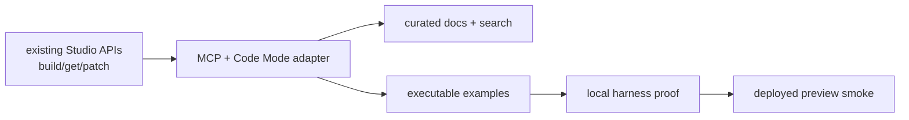

# Code Mode Next PR Plan

This tracks the remaining implementation intent for the next Code Mode PR.
Completed host API/runtime/storage behavior is intentionally not listed here;
the code is the source of truth for completed behavior.

## Scope

Build the thin harness-facing layer over the existing Studio host APIs so Codex,
Claude Code, OpenCode, and similar clients can discover the contract, run
Code Mode JavaScript, and prove the flowchart artifact loop end to end.

## Current TODO Tasks

- [x] Capture a broad Agy/tmux Code Mode scenario suite before adding heavier
      eval infrastructure. Use Agy as the visible primary surface and consolidate
      results in one tracked-or-promoted Markdown report once the shape is
      useful. Each row should capture prompt, harness, model, reasoning level,
      raw JSON artifact URL, raw PNG artifact URL, and brief notes.
      First capture:
      [Agy Code Mode Scenario Capture](evals/agy-code-mode-scenario-capture-2026-06-27.md).
      Current harness closure:
      [Agy Code Mode Current Suite](evals/agy-code-mode-current-suite-2026-07-10.md).
- [x] Cover multiple complexity bands in that suite: simple linear flow, basic
      decision tree, nested decisions, retry/loop workflow, lifecycle/state
      machine, incident escalation, actor handoff/swimlane-like flow,
      repo/package architecture, dense 10-15 node business process, and one
      vague prompt that forces the harness to infer structure.
- [x] Preserve initial real MCP/API usage server-side so ordinary agent traffic
      can become the eval surface. Studio now writes
      `sketchi.codemode.usage.v1` event records with bounded request/response
      snapshots into the existing R2 artifact bucket for MCP `execute`,
      `buildFlowchart`, and `applyDiagramPatch`.
- [x] Project that usage stream into remote Cloudflare Pipeline streams. Studio
      sends flat request rows and per-issue rows to production and preview
      streams from the Worker bindings.
- [x] Attach the Pipeline streams to R2 Data Catalog tables. The
      credential-aware R2 Catalog smoke is green with
      `WRANGLER_R2_SQL_AUTH_TOKEN` set to a real R2 API token that has Admin
      Read & Write permissions; it proved a Pipeline-ingested row through a
      direct R2 SQL aggregate data scan, not just table metadata. The real
      production and preview Code Mode streams now write to the v4 analytics
      catalog buckets, and a live intentionally failing API run pair was
      queried back from `usage_events` and `usage_issues`.
- [ ] Enrich usage capture once more harness/model metadata is available. Keep
      adding tool sequence detail, retry detail, token/cost buckets when
      available, and model or harness error text without changing the public MCP
      contract.
- [x] Add README files for each Nx package/app/tool that does not have one yet.
      Match the existing concise package README style: one-sentence purpose,
      quick Mermaid diagram, owns/does-not-own table, common commands, and how
      the package is used by the rest of the workspace.

## Work Items

### 1. Thin MCP / Code Mode Adapter

Plan: expose the small harness-facing surface (`docs`, `search`, `execute`) and
inject a `sketchi` client with `buildFlowchart`, `getArtifact`, and
`applyDiagramPatch`. The adapter should reuse the same request and response
contracts as the existing `/api/v1/*` Studio routes and must not expose storage
bindings, model credentials, validation, grading, rendering, or export internals.

Acceptance: tool listing shows only the curated public surface; an adapter test
can call the three `sketchi.*` functions through `execute`; malformed inputs
return the same structured issue shape as the host APIs.

### 2. Curated Docs And Search

Plan: add compact docs and search content that teaches the agent sequence:
first make the semantic flow and connectivity correct, then apply visual patch
operations. Include operation summaries, selector guidance, issue-code repair
hints, and the non-goals that keep raw Excalidraw editing out of the public
contract.

Acceptance: `docs({ topic })` returns useful focused guidance for overview,
execute, build, artifact retrieval, patching, agent sequence, and issues;
`search({ query })` can find the relevant operation or repair hint without
surfacing internal pipeline functions.

### 3. Executable Examples

Plan: add examples that run the intended sequence:
`buildFlowchart -> inspect/getArtifact -> applyDiagramPatch`. At least one
example should start from a user-style request such as a circle connected to a
purple decision diamond, then split that into graph construction followed by
structured patch operations.

Acceptance: examples execute without hidden credentials in fixture mode; the
returned final artifact includes `scene` and `excalidraw` formats; examples fail
clearly when the graph is not accepted before styling.

### 4. Local Harness / Eval Proof

Plan: add a local proof command that exercises the same Code Mode adapter
contract a harness will use. It should run fixture scenarios, persist evidence
under `.memory/`, and verify the returned artifacts enough to catch empty output,
missing nodes, missing edges, unavailable formats, and patch selector mistakes.

Acceptance: local proof runs from a clean checkout; evidence includes request,
response, artifact ids, and selected artifact payloads; failures are structured
and actionable rather than raw stack traces.

### 5. Deployed Studio Preview Smoke

Plan: smoke the same sequence against the deployed Studio preview Worker. Use
the preview URL as the external boundary and prove that R2-backed artifacts can
be built, retrieved, patched, and retrieved again. Preview deploys must treat R2
buckets as pre-existing infra and run Wrangler with resource provisioning
disabled.

Acceptance: smoke evidence records the preview URL, Worker/version context when
available, build artifact id, patched artifact id, `getArtifact` result, and the
fact that the CI preview deploy remains green.

## Non-Goals

- Rebuilding the host API runtime already present in Studio.
- Convex managed threads, accepted artifact lineage, or Studio chat/canvas
  parity.
- Raw Excalidraw JSON editing as the primary public mutation path.
- Structural patch operations that create or delete nodes and edges.
