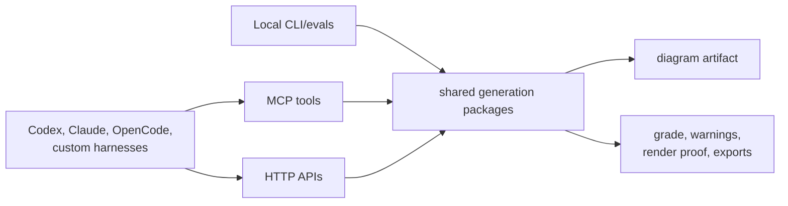
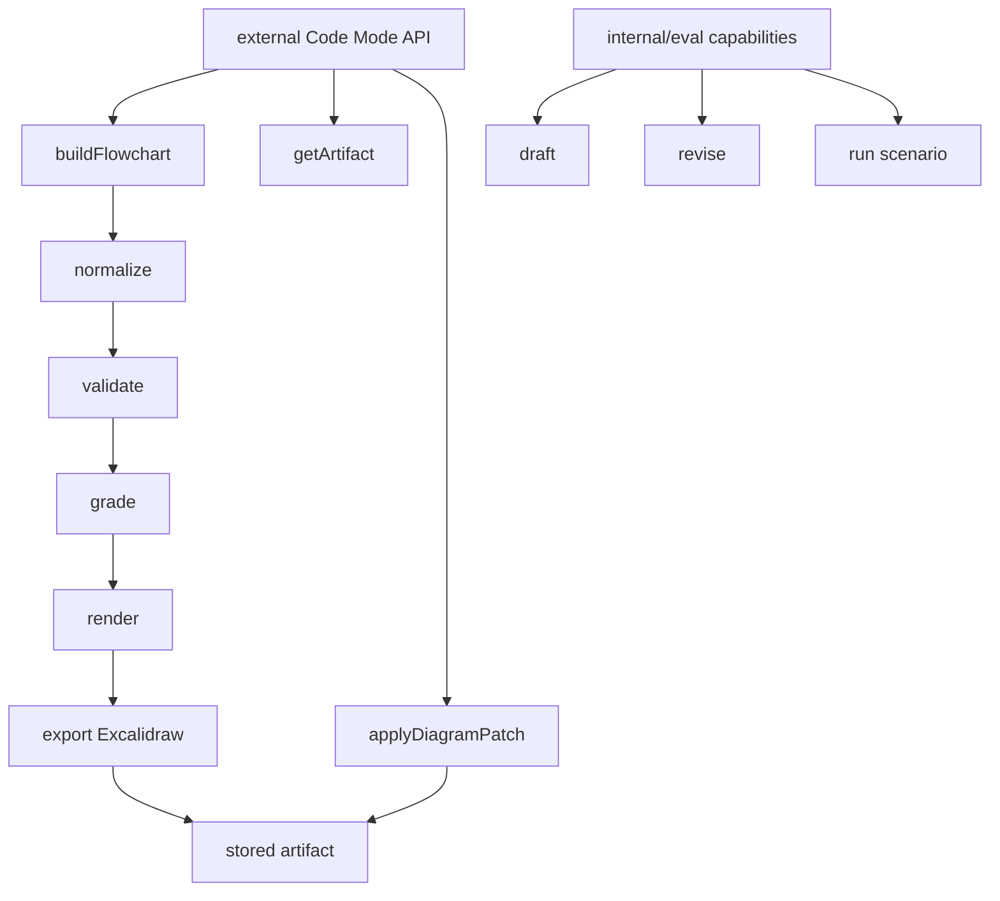
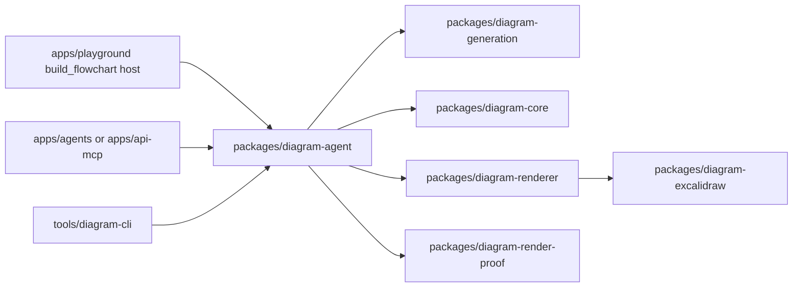
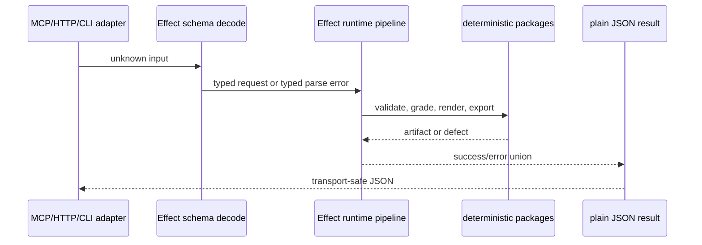
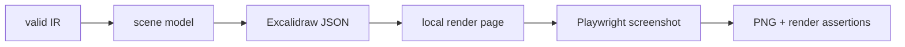
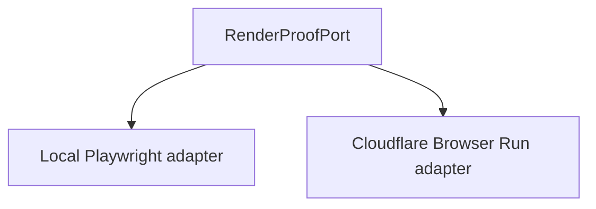
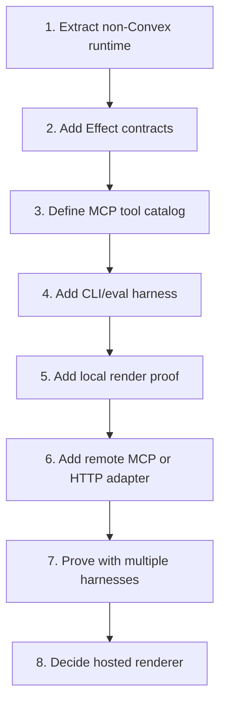

# MCP-First Generation Scope

## Decision

Do every useful generation capability that does **not** require Sketchi-owned
threads, durable runs, user accounts, or Convex storage.

The product bet is that most early usage comes through MCP and external agent
harnesses. The repo should therefore make generation valuable before the normal
managed UI exists.

## In Scope

| Capability                  | User value                                             | Convex dependency |
| --------------------------- | ------------------------------------------------------ | ----------------- |
| Draft a diagram from intent | Get a usable first artifact from messy input           | None              |
| Revise a supplied diagram   | Caller keeps state, Sketchi applies a requested change | None              |
| Normalize model/tool output | Recover useful IR from imperfect model output          | None              |
| Validate IR                 | Explain structural defects before rendering            | None              |
| Grade artifact quality      | Tell agents whether the result is strong enough        | None              |
| Render proof                | Produce visual evidence for tests and agents           | None              |
| Export Excalidraw           | Give callers a real portable artifact                  | None              |
| Run scenarios               | Regression/demo suite for generation quality           | None              |
| Serve MCP tools             | Let many agent harnesses call the same capabilities    | None              |

## Out Of Scope

| Defer                          | Why                                             |
| ------------------------------ | ----------------------------------------------- |
| Managed threads                | Requires Convex messages/runs/artifact history  |
| User-owned artifact library    | Requires auth, persistence, and product records |
| Studio version history         | Requires durable lineage                        |
| Account/team/rate-limit policy | Requires product state                          |
| Confect/Convex refactor        | Useful later, not needed for MCP-first value    |

## Capability Surface

These are product capabilities the shared runtime should own. They are not all
external tools. The concrete external Code Mode contract is intentionally much
smaller and is specified in [Sketchi Code Mode API Contract](mcp-tool-catalog.md).

| Capability              | First public shape                   | Notes                                                                |
| ----------------------- | ------------------------------------ | -------------------------------------------------------------------- |
| Build a flowchart spec  | `buildFlowchart`                     | One call folds normalize, validate, grade, render, export, and store |
| Retrieve an artifact    | `getArtifact`                        | Uses artifact id, not diagram id alone                               |
| Patch an artifact       | `applyDiagramPatch`                  | Deterministic non-structural style, shape, text, and layout codemods |
| Normalize model output  | internal to `buildFlowchart`         | Public callers get structured `Issue[]`                              |
| Validate IR             | internal to `buildFlowchart`         | Not a standalone external tool                                       |
| Grade artifact quality  | internal to `buildFlowchart`         | Returned as part of `BuildFlowchartResult`                           |
| Render proof/export     | internal to `buildFlowchart`         | Scene, Excalidraw, and hosted PNG artifacts                          |
| Draft from prompt       | later                                | Needs free-prompt generation contract                                |
| Revise supplied diagram | later or internal eval               | Caller owns state in this phase                                      |
| Run scenarios           | CLI/eval surface, not public MCP API | Useful for regression and examples                                   |

Do not expose internal pipeline steps as public MCP tools just because Code Mode
can call code. Code Mode is still an external API boundary; keep it product
level.

Do not add thread tools yet:

- no `create_thread`;
- no `continue_thread`;
- no `list_user_artifacts`;
- no `accept_artifact`;
- no `get_run_status`.

The visible Studio chat/canvas now uses this same contract. Its model-facing
`build_flowchart` tool accepts the canonical request without caller-controlled
artifact options; the Studio host injects scene and Excalidraw output, displays
the returned structured issues during repair, and uses the accepted artifact
directly. Managed history and cross-turn lineage still wait for Convex threads.

## Package Plan

| Package/app                     | Responsibility                                                                         |
| ------------------------------- | -------------------------------------------------------------------------------------- |
| `diagram-agent`                 | canonical build contracts, normalization, grading, render/export, artifact persistence |
| `diagram-generation`            | Gemini request/response and candidate parsing                                          |
| `diagram-core`                  | IR schema, parse, semantic validation                                                  |
| `diagram-renderer`              | deterministic scene generation                                                         |
| `diagram-excalidraw`            | Excalidraw conversion/export validation                                                |
| `diagram-render-proof`          | browser-backed visual proof adapter                                                    |
| `apps/api-mcp` or `apps/agents` | remote MCP/HTTP adapters over the package runtime                                      |
| `tools/diagram-cli`             | local commands for evals and non-hosted tests                                          |

## Effect Refactor

Use Effect where it improves the actual generation runtime. Do not spread it
through every package for aesthetics.

| Step                                                     | Scope                                                       |
| -------------------------------------------------------- | ----------------------------------------------------------- |
| 1. Add Effect to the generation package layer            | Keep Zod at route boundaries until replacement earns itself |
| 2. Define typed request/result/error contracts           | Same contracts feed MCP, HTTP, CLI, tests                   |
| 3. Convert model output parsing into Effect decode paths | Bad model output becomes structured recoverable failure     |
| 4. Encode grading and repair as typed results            | Agents can decide whether to retry, revise, or accept       |
| 5. Add adapters back to plain JSON/Zod when needed       | MCP clients should not need to understand Effect            |

Do not use Effect for React state, Convex schemas, or route handler plumbing in
this slice.

## Rendering Plan

We need two separate rendering concepts:

| Need                               | Local/dev answer                | Production/CI answer                   |
| ---------------------------------- | ------------------------------- | -------------------------------------- |
| Deterministic diagram layout       | existing `diagram-renderer`     | same                                   |
| Excalidraw export                  | existing `diagram-excalidraw`   | same                                   |
| Visual proof for tests/agents      | optional local Playwright proof | Cloudflare Browser Run artifact render |
| Production PNG/PDF-style rendering | no local browser requirement    | Cloudflare Browser Run for PNG         |

Local debug utility:

Why keep local optional:

- the repo already has Playwright;
- it is useful for developer debugging and `.memory/` evidence;
- it must not become a separate CI production path;
- it gives the hosted renderer a compatibility target without requiring users
  or plugins to install browser binaries.

Then add a hosted render port:

### Hosted Candidates

| Option                 | Good for                                                                      | Watch out                                                        |
| ---------------------- | ----------------------------------------------------------------------------- | ---------------------------------------------------------------- |
| Browserbase Functions  | Playwright-native scripts deployed as API-callable browser functions          | Adds another vendor and provider/runtime constraints to review   |
| Cloudflare Browser Run | Worker-aligned screenshots/PDFs/browser sessions near existing deploy surface | Needs Worker binding/API setup and browser-runtime limits review |
| Local Playwright only  | Fastest developer proof                                                       | Not a production or CI render service                            |

Decision: use Cloudflare Browser Run for hosted PNG artifacts because Code Mode,
R2 artifact storage, and the Studio MCP/API surface already run on Workers.
Browserbase Functions remains the fallback only if Browser Run cannot satisfy
the Excalidraw export harness.

## Implementation Steps

### 1. Extract Non-Convex Runtime

Keep the canonical build behavior importable as one package vertical:

- normalize and validate `FlowchartSpec`;
- grade with structured quality checks;
- render and validate exports;
- persist exactly one artifact after acceptance.

Studio, HTTP, and MCP call that package runtime directly. Surface adapters may
own attempt budgets and host artifact options, but they do not remap or persist
the result again.

### 2. Add Effect Contracts

Create stable request/result/error contracts around generation operations.

Acceptance:

- bad input returns typed errors;
- malformed model output is recoverable;
- public JSON result shape is documented;
- tests cover success, validation failure, model-output failure, and repairable
  failure.

### 3. Define Code Mode API Contract

Document the external MCP shell, Code Mode functions, input schemas, output
schemas, issue taxonomy, and artifact contract before writing transport code.

Acceptance:

- the public surface is product-level, not pipeline-level;
- descriptions explain when an agent should call `buildFlowchart` and
  `getArtifact`;
- no managed thread tools are included;
- host APIs, MCP, and CLI can reuse the same request/result contracts.

### 4. Add CLI/Eval Harness

Build local commands that exercise the exact same package runtime as MCP will.

Acceptance:

- run one scenario with fixture mode;
- run one scenario with Gemini mode when credentials are present;
- write `.memory/` evidence for artifacts and render screenshots;
- no Convex env required.

### 5. Add Local Render Proof

Keep a local Playwright-backed utility that opens a minimal render page and
captures evidence for developer debugging only.

Acceptance:

- PNG evidence exists for a valid flowchart;
- assertions catch blank canvas, missing nodes, and obvious text/layout failure;
- this works without a deployed app;
- CI does not rely on this path instead of the deployed Worker renderer.

### 6. Add Remote Adapter

Expose the same catalog through a remote MCP or HTTP app, likely Worker-backed.

Acceptance:

- endpoint is independently deployable;
- local package imports are native Nx imports;
- tool calls return the same result shape as CLI;
- no Convex calls or Convex env vars.

### 7. Prove With Multiple Harnesses

The first proof should not be "works in our UI."

Acceptance:

- CLI proof;
- local MCP client proof;
- Codex or Claude MCP proof;
- Worker preview proof if remote adapter is included;
- one scenario matrix proof with generated artifact evidence.

### 8. Decide Hosted Renderer

Use Cloudflare Browser Run as the hosted renderer.

Acceptance:

- one Cloudflare Browser Run proof renders a hosted PNG artifact from the same
  production path agents use;
- failures are mapped to the same typed render errors;
- the hosted renderer is optional at runtime but required for `png` artifact
  requests to succeed.

## Proof Matrix

| Proof                              | Required before Convex?                 |
| ---------------------------------- | --------------------------------------- |
| `pnpm nx test diagram-agent`       | yes                                     |
| `pnpm nx test diagram-generation`  | yes                                     |
| local CLI scenario fixture         | yes                                     |
| local CLI Gemini scenario          | yes when credentials exist              |
| hosted Browser Run PNG proof       | yes                                     |
| MCP tool listing                   | yes                                     |
| MCP draft/revise/grade call        | yes                                     |
| remote Worker preview smoke        | yes if adapter is in the PR             |
| managed thread smoke               | no                                      |
| Studio artifact history            | no                                      |
| Studio chat/canvas artifact parity | yes, through canonical `buildFlowchart` |

## References

- Agentic generation overview: [docs/agentic-generation.md](agentic-generation.md)
- Cloudflare Browser Run: https://developers.cloudflare.com/browser-run/
- Browserbase Functions:
  https://docs.browserbase.com/platform/runtime/overview
- Effect Schema: https://effect.website/docs/schema/introduction/
- MCP TypeScript SDK: https://ts.sdk.modelcontextprotocol.io/
