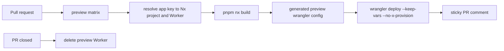

# App Preview Deploys

## Current Matrix

| App key      | Nx project   | Preview Worker                   | Production Worker    | Product route status                                                      |
| ------------ | ------------ | -------------------------------- | -------------------- | ------------------------------------------------------------------------- |
| `web`        | `web`        | `sketchi-web-pr-<number>`        | `sketchi-web`        | `sketchi.app`, `www.sketchi.app`                                          |
| `studio`     | `studio`     | `sketchi-studio-pr-<number>`     | `sketchi-studio`     | `playground.sketchi.app` manual attach target; `studio.sketchi.app` later |
| `icons`      | `icons`      | `sketchi-icons-pr-<number>`      | `sketchi-icons`      | `icons.sketchi.app`                                                       |
| `playground` | `playground` | `sketchi-playground-pr-<number>` | `sketchi-playground` | internal eval harness; not linked from public navigation                  |
| `excalidraw` | `excalidraw` | `sketchi-excalidraw-pr-<number>` | `sketchi-excalidraw` | internal rendering workspace; not a public product domain                 |

The app key is deployment metadata, not an Nx project-name convention.
`scripts/lib/worker-apps.mjs` maps each app key to its current `nxProjectId`,
durable Cloudflare Worker name, input config, and generated artifact paths.
Future repository renames change the Nx/project fields without changing Worker
names or other durable Cloudflare resources.

Each Worker build is isolated under `dist/apps/<app>/`: browser assets go to
`client/`, Worker code and the generated deploy snapshot go to `server/`, and
the generated config is `server/wrangler.json`. The Cloudflare Vite plugin's
deploy redirect is also isolated at `apps/<project>/.wrangler/deploy/config.json`.
Parallel Nx builds therefore never write another app's deployable output.



## Preview Workflow

Pull requests to `main` deploy matrix apps to PR-specific Cloudflare Workers.

- uses the same pnpm 11.5.0, Node 24, `pnpm install --frozen-lockfile` setup as
  the required `ci` workflow;
- builds each Nx app in an isolated matrix job;
- reads the app-scoped `dist/apps/<app>/server/wrangler.json` build snapshot;
- writes `dist/apps/<app>/server/wrangler.preview.json` with the preview Worker
  name and no custom production routes;
- runs `wrangler deploy --keep-vars --no-x-provision`;
- writes or updates one sticky PR comment per app with the preview URL and an
  explicit public/internal surface policy.

For the `web` preview, the workflow also reads the account workers.dev
subdomain from Cloudflare and injects sibling preview URLs into the generated
Wrangler vars. `SKETCHI_PLAYGROUND_URL` points at the `studio` preview Worker
because that app currently implements the public Playground worker boundary;
`apps/playground` remains the internal eval harness.

- `SKETCHI_ICONS_URL`
- `SKETCHI_PLAYGROUND_URL`

That keeps Web preview navigation inside the same PR's preview Workers instead
of sending reviewers to production domains.

Preview comments intentionally distinguish product previews from internal tool
previews. `web`, `studio`, and `icons` are public-product previews.
`playground` and `excalidraw` are internal previews only; their comments exist
for reviewer smoke tests and cleanup visibility, not public navigation.

## Required Configuration

- `CHROMATIC_PROJECT_TOKEN`: `staging` environment secret for Storybook
  publish and visual checks.
- `GRAPHITE_TOKEN`: optional repository secret only if Graphite CI optimization
  is reintroduced; the canonical required and preview workflows do not depend
  on it.
- `CLOUDFLARE_ACCOUNT_ID`: `staging` environment variable or secret.
- `CLOUDFLARE_API_TOKEN`: `staging` environment secret with Workers
  edit/deploy access.

| Source                                  | Target                          | Purpose                                        |
| --------------------------------------- | ------------------------------- | ---------------------------------------------- |
| Infisical `sketchi` `/github` `staging` | GitHub `staging` environment    | CI, Graphite optimizer, and PR preview deploys |
| Infisical `sketchi` `/github` `prod`    | GitHub `production` environment | production deploys                             |

The canonical source for those GitHub Actions values is the Infisical `sketchi`
project under `/github`, synced to GitHub environment secrets:

- `staging`: GitHub `staging` environment for CI and PR preview deploys.
- `prod`: GitHub `production` environment for production deploys.

Do not sync both Infisical environments into the same repository-secret
namespace; environment-scoped GitHub secrets keep preview and production values
from overwriting each other when the values eventually diverge.

Cloudflare documents that non-interactive CI deploys require an API token and
account ID. The token should stay in GitHub Secrets, not in source control.
Preview deploys pass `--no-x-provision` so CI only uploads explicit Worker
configuration. Preview deploys must not create, discover, or mutate KV, D1, or
R2 resources.

## Cleanup

Cleanup runs automatically when a PR closes and deletes the PR-specific Worker.
Manual cleanup is also available:

```sh
CLOUDFLARE_ACCOUNT_ID=... CLOUDFLARE_API_TOKEN=... \
  node scripts/04-delete-preview-worker.mjs --pr-number 123
```

## Operational Scripts

The deploy command scripts are numbered because they are operational steps:

- `scripts/00-resolve-worker-app.mjs`
- `scripts/01-prepare-preview-deploy.mjs`
- `scripts/02-extract-preview-url.mjs`
- `scripts/03-upsert-preview-comment.mjs`
- `scripts/04-delete-preview-worker.mjs`
- `scripts/05-prepare-production-domain-deploy.mjs`

Pass `--app playground`, `--app studio`, `--app web`, `--app excalidraw`, or
`--app icons` to the prepare and cleanup scripts when running them manually.

## Production Worker Deploys

The `app-production-deploy` workflow runs on pushes to `main` and deploys the
five wired production Workers without assigning final custom domains. Production
deploys also pass `--no-x-provision`; Workers may bind existing resources, but
CI deploys do not create or discover storage.

Those deploys keep `workers_dev` enabled so the app can be verified from
Cloudflare-owned `workers.dev` URLs before any DNS or registrar cutover.
Production deploy summaries include the same public/internal route policy and
the custom domains that would be attached by a manual domain dispatch. Internal
apps report no custom domains.

The Studio Worker binds Code Mode artifacts to R2 and Code Mode usage analytics
to Cloudflare Pipelines:

| Surface                  | Binding                 | Remote target                                  |
| ------------------------ | ----------------------- | ---------------------------------------------- |
| Studio preview Workers   | `SKETCHI_ARTIFACTS`     | `sketchi-studio-codemode-artifacts-preview`    |
| Studio production Worker | `SKETCHI_ARTIFACTS`     | `sketchi-studio-codemode-artifacts-production` |
| Studio preview Workers   | `CODEMODE_USAGE_EVENTS` | `e9fc3bcd35314fa39fc6a89018207acc`             |
| Studio preview Workers   | `CODEMODE_USAGE_ISSUES` | `d95a1767edf246af8c637c5b9bf5a5c5`             |
| Studio production Worker | `CODEMODE_USAGE_EVENTS` | `d9044253316f4273a60298098f444a62`             |
| Studio production Worker | `CODEMODE_USAGE_ISSUES` | `f687dab6e7d742c1a76834089e709462`             |

Preview Wrangler configs rewrite the Studio artifact binding to the preview
bucket and the Studio Pipeline bindings to preview streams. Production deploys
keep production buckets and production streams. All Worker-bound buckets and
streams must exist before their Workers deploy. The downstream R2 Data Catalog
sinks are long-lived Cloudflare Pipeline resources, not Worker bindings. They
write into `sketchi-codemode-usage-analytics-production-v4` and
`sketchi-codemode-usage-analytics-preview-v4`; run
`pnpm r2sql:codemode:resources` to print the sink, pipeline, bucket, and table
map. Preview deploys disable Wrangler resource provisioning, so the CI token
does not need R2 object read access just to deploy the Worker.

R2 Data Catalog verification must prove an aggregate R2 SQL data scan through
the direct R2 SQL API, not just `SHOW TABLES` or `DESCRIBE`, because
metadata-only catalog calls can succeed before rows are queryable. The
2026-06-29 real end-to-end check called production and preview Studio APIs with
unique `x-sketchi-run-id` headers, then verified both `usage_events` and
`usage_issues` rows in the v4 catalog buckets with
`pnpm r2sql:codemode:verify-run -- --require-issues`. The verifier polls R2
SQL by default. For normal successful API runs, issue rows may be absent; the
command only requires issue rows when `--require-issues` or explicit
issue-run-id options are supplied.

Wrangler accepts Pipeline stream names in local dry-runs, but the deploy API
requires stream IDs for Worker bindings. Keep `apps/studio/wrangler.jsonc` on
the production stream IDs and keep the preview deploy helper's ID rewrite table
in sync with Cloudflare Pipeline stream creation.

Custom domains are a post-merge operator action. The production workflow writes
a generated `dist/apps/<app>/server/wrangler.domains.json` config from
`scripts/05-prepare-production-domain-deploy.mjs` and deploys that route-bearing
config only when explicitly dispatched with `domain_action=attach`. Follow
[Production domain cutover](production-domain-cutover.md); never attach domains
from a pull request or before the Cloudflare zone is active.

When `domain_action=attach`, the production domain helper attaches
`playground.sketchi.app` to the `studio` app because `apps/studio` currently
carries the public Playground worker boundary. `studio.sketchi.app` remains a
future custom domain until product auth is wired, even though the Studio app now
has `/projects` and persisted `/diagrams/:diagramId` route foundations. The
`playground` app has no public domain patterns; it is the internal eval harness
Worker.

The eval harness and standalone Excalidraw workspace should remain unlinked from
public navigation. Do not attach a public `excalidraw.sketchi.app` product route
unless that product-route decision is explicitly reopened.
