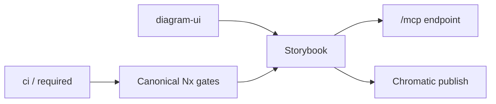

# Storybook, Chromatic, and MCP

## At A Glance

| Need                    | Command or URL                                                 |
| ----------------------- | -------------------------------------------------------------- |
| Run local Storybook     | `pnpm nx storybook diagram-ui -- --ci --host 127.0.0.1` |
| Build Storybook         | `pnpm nx build-storybook diagram-ui`                    |
| Publish/check Chromatic | `pnpm nx chromatic diagram-ui`                          |
| Local MCP endpoint      | `http://127.0.0.1:6006/mcp`                                    |



## Targets

`diagram-ui` owns the reusable Studio component stories. The Storybook
targets are Nx targets:

- `pnpm nx storybook diagram-ui`
- `pnpm nx build-storybook diagram-ui`
- `pnpm nx chromatic diagram-ui`

The Storybook serve/build targets use `@nx/storybook` executors. Chromatic does
not ship as an Nx executor in this workspace, so `chromatic` is a small
`nx:run-commands` target that depends on `build-storybook`.

## MCP

`@storybook/addon-mcp` is installed and registered in
`packages/diagram/ui/.storybook/main.ts`. When Storybook is running, the
local MCP server is available at:

```sh
http://127.0.0.1:6006/mcp
```

Register it for Codex with:

```sh
npx mcp-add \
  --type http \
  --url "http://127.0.0.1:6006/mcp" \
  --name "sketchi-storybook" \
  --scope project \
  --clients codex
```

Then start Storybook before asking an agent to inspect component docs:

```sh
pnpm nx storybook diagram-ui -- --ci --host 127.0.0.1
```

Useful first MCP prompt:

```text
Use the Storybook MCP server and run list-all-documentation for Sketchi UI components.
```

Chromatic publishes the MCP endpoint with the Storybook build at the same
published URL under `/mcp`.

## CI Contract

The required `ci / required` job runs the full workspace
`typecheck,test,build` matrix and always builds `diagram-ui` Storybook.
Chromatic remains an explicit, token-backed publishing target rather than a
required pull-request check.

TurboSnap is intentionally off for now. Chromatic recommends getting successful
CI builds established first, and the initial `--only-changed` attempt failed
because the prebuilt Storybook did not include `preview-stats.json`. Revisit
TurboSnap once the baseline is stable and add stats generation deliberately.

## First Baseline

Until Chromatic has a `main` baseline, UI Review may ask for a patch build. Use
the token from Infisical rather than pasting it into a shell history:

```sh
infisical run --env=staging --path=/github -- \
  pnpm exec chromatic \
    --storybook-build-dir storybook-static/diagram-ui \
    --storybook-config-dir packages/diagram/ui/.storybook \
    --storybook-base-dir packages/diagram/ui \
    --patch-build=chore/chromatic-storybook-contrast...main
```
