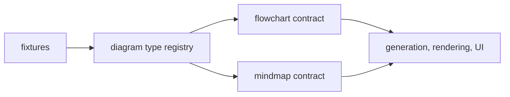

# diagram-core

Typed diagram contracts, validation, and fixtures for every Sketchi diagram type.



| Owns                            | Does not own                |
| ------------------------------- | --------------------------- |
| diagram type registry           | model calls or prompts      |
| typed IR shapes and invariants  | layout or scene coordinates |
| reusable fixtures               | Excalidraw element output   |
| semantic validation diagnostics | app routes or persistence   |

## Commands

```sh
pnpm nx test diagram-core
pnpm nx typecheck diagram-core
pnpm nx build diagram-core
```

## Usage

All generation, rendering, scenario, and app surfaces should pass diagram data
through this package before rendering or exporting. Add new diagram types here
first so invalid references, missing labels, and diagram-specific invariants
fail before they reach UI or artifact code.
