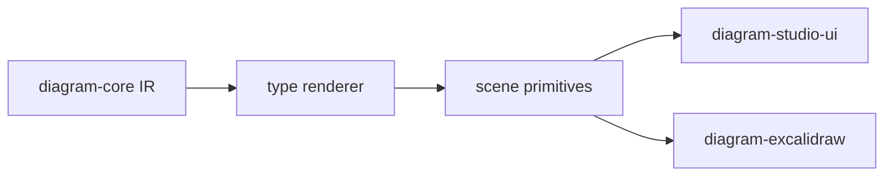

# diagram-renderer

Deterministic scene generation for validated Sketchi diagram IR.



| Owns                           | Does not own                  |
| ------------------------------ | ----------------------------- |
| deterministic scene primitives | semantic IR validation        |
| diagram-type layout logic      | Excalidraw element conversion |
| renderer fixtures and tests    | model calls or grading        |
| stable geometry for previews   | app routes or artifact stores |

## Commands

```sh
pnpm nx test diagram-renderer
pnpm nx typecheck diagram-renderer
pnpm nx build diagram-renderer
```

## Usage

Use this package after `diagram-core` accepts a diagram and before any UI or
export path needs coordinates. Keep rendering deterministic here so component
tests, Storybook states, and Excalidraw conversion all see the same scene model.
