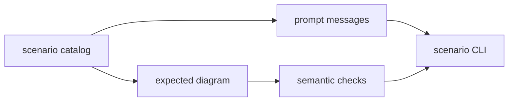

# diagram-scenarios

Maintained prompts, expected diagrams, and scenario evaluation for Sketchi generation work.



| Owns                              | Does not own                   |
| --------------------------------- | ------------------------------ |
| scenario catalog and prompts      | provider credentials           |
| expected diagram fixtures         | live app routing               |
| semantic output checks            | Excalidraw rendering internals |
| local command-provider CLI wiring | final product UX               |

## Commands

```sh
pnpm nx test diagram-scenarios
pnpm nx typecheck diagram-scenarios
pnpm nx build diagram-scenarios
pnpm nx scenario diagram-scenarios -- --scenario pharma-batch-disposition --fixture --out .memory/pharma-batch.excalidraw
```

## Usage

Generation packages, playground routes, and harness evals use these scenarios as
the stable product-quality substrate. Add new scenarios here when a diagram
failure should become repeatable before it grows into heavier eval tooling.
