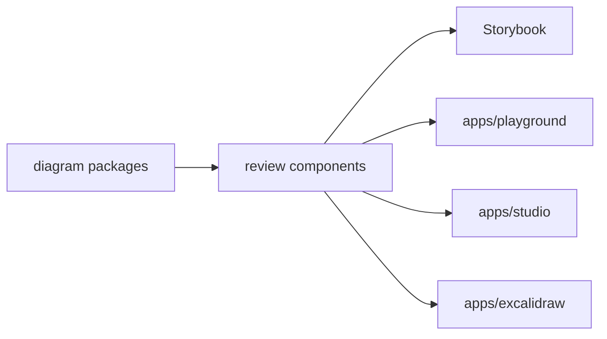

# diagram-studio-ui

Reusable React components and Storybook states for Sketchi diagram review surfaces.



| Owns                                  | Does not own                   |
| ------------------------------------- | ------------------------------ |
| reusable diagram review components    | app routes or navigation       |
| scenario playground UI states         | Worker APIs or persistence     |
| Excalidraw canvas wrappers for review | model calls or Code Mode tools |
| shared component CSS and Storybook    | production domain deployment   |

## Commands

```sh
pnpm nx test diagram-studio-ui
pnpm nx typecheck diagram-studio-ui
pnpm nx build diagram-studio-ui
pnpm nx storybook diagram-studio-ui
pnpm nx build-storybook diagram-studio-ui
```

## Usage

Apps compose this package when they need diagram previews, scenario evaluation,
generation run panels, or JSON inspection. Keep reusable state and component
coverage here; app-specific routing and service calls stay inside `apps/*`.
