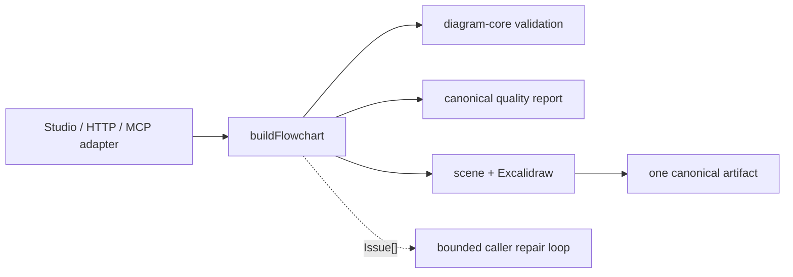

# diagram-agent

Canonical diagram build runtime shared by Studio, the HTTP API, and Code Mode
MCP. `buildFlowchart` owns the complete accepted-artifact vertical: request
decode, FlowchartSpec normalization, semantic validation, quality assessment,
deterministic rendering, export validation, and one artifact-store write.



| Owns                                                | Does not own                    |
| --------------------------------------------------- | ------------------------------- |
| Canonical request/result and structured issue types | Model calls and chat streaming  |
| FlowchartSpec normalization and quality assessment  | Per-surface credentials or auth |
| Deterministic render/export/persistence pipeline    | Managed chat threads            |
| Artifact store interfaces and Code Mode operations  | Studio presentation state       |

Studio exposes the runtime to its model as `build_flowchart`. That host injects
artifact formats and a three-attempt per-turn cap; it does not map into another
flowchart schema or persist the accepted result a second time.

## Commands

```sh
pnpm nx test diagram-agent
pnpm nx typecheck diagram-agent
pnpm nx build diagram-agent
```

The public contract and repair behavior are documented in
[docs/mcp-tool-catalog.md](../../../docs/mcp-tool-catalog.md).
