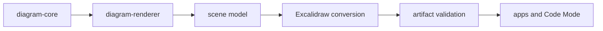

# diagram-excalidraw

Conversion and validation for real Excalidraw artifacts generated from Sketchi scenes.



| Owns                               | Does not own                       |
| ---------------------------------- | ---------------------------------- |
| scene-to-Excalidraw element output | diagram semantic validation        |
| arrow bindings and bound text      | deterministic layout source        |
| Excalidraw artifact validation     | model prompts or agent policy      |
| patchable persisted scene shape    | Worker routes or R2 object storage |

## Commands

```sh
pnpm nx test diagram-excalidraw
pnpm nx typecheck diagram-excalidraw
pnpm nx build diagram-excalidraw
```

## Usage

Use this package at the export boundary when a validated scene needs to become
inspectable Excalidraw JSON. Code Mode and Studio should keep asking for
structured diagram or patch operations; raw Excalidraw editing belongs behind
this package boundary.

## Node logos

A scene node with an `icon` and an embedded asset in `scene.icons` becomes an
Excalidraw `image` element, placed with `canvasNodeIconBox`. The scene's `files`
map holds the SVG as a base64 data URL, keyed by a content-addressed `fileId`.
The node's shape, bound label, and logo share one group so they move together.
Bottom- and top-aligned bound labels use Excalidraw's own position rules, so a
logo node's label stays put when it is edited. Pass `files` through to
Excalidraw's `initialData` so logos paint on the first frame.
