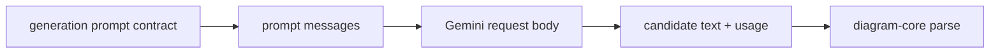

# diagram-generation

Model-facing generation helpers for Sketchi diagram candidates.



| Owns                                      | Does not own                  |
| ----------------------------------------- | ----------------------------- |
| provider prompt and request contracts     | eval scenarios and assertions |
| prompt message mapping                    | chat threads                  |
| Gemini REST body mapping                  | artifact persistence          |
| Effect client contract and Workers layers | UI streaming                  |
| candidate parsing and diagnostics         | final grading/revision policy |

## Commands

```sh
pnpm nx test diagram-generation
pnpm nx typecheck diagram-generation
pnpm nx build diagram-generation
```

## Direction

`DiagramGenerationClient` is the Effect-native primary API. Workers compose the
Cloudflare AI Gateway binding, configuration, policy, and live client layers at
their runtime boundary. Pure prompt, response, and candidate helpers stay
independent of that wiring. Node support belongs in a later live layer, not a
parallel Promise client.
