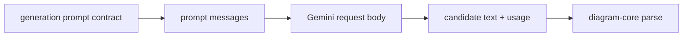

# diagram-generation

Model-facing generation helpers for Sketchi diagram candidates.



| Owns                                      | Does not own                  |
| ----------------------------------------- | ----------------------------- |
| provider prompt and request contracts     | eval scenarios and assertions |
| prompt message mapping                    | chat threads                  |
| Gemini REST body mapping                  | artifact persistence          |
| Effect client contract and runtime layers | UI streaming                  |
| candidate parsing and diagnostics         | final grading/revision policy |

## Commands

```sh
pnpm nx test diagram-generation
pnpm nx typecheck diagram-generation
pnpm nx build diagram-generation
```

## Direction

`DiagramGenerationClient` is the Effect-native primary API. Workers compose the
Cloudflare AI Gateway binding at their runtime boundary. Node hosts compose
`CloudflareGoogleAiStudioHttpClientLive` with an authenticated AI Gateway
provider-native URL, fetch, and the shared generation policy. The gateway token
authenticates the Cloudflare request, while the gateway supplies its stored
Google AI Studio BYOK key. The Node layer uses the Google AI SDK boundary without
reading or sending a Google API key and preserves the same timeout, retry,
cancellation, and candidate parsing behavior. Pure prompt, response, and
candidate helpers stay independent of runtime wiring.
