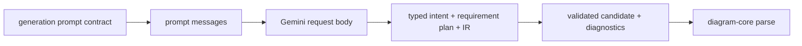

# diagram-generation

Model-facing generation helpers for Sketchi diagram candidates.



| Owns                                      | Does not own                  |
| ----------------------------------------- | ----------------------------- |
| provider prompt and request contracts     | eval scenarios and assertions |
| prompt message mapping                    | chat threads                  |
| Gemini REST body mapping                  | artifact persistence          |
| Effect client contract and runtime layers | UI streaming                  |
| candidate parsing and diagnostics         | final grading/revision policy |
| deterministic intent-plan enforcement     | artifact persistence          |

## Commands

```sh
pnpm nx test diagram-generation
pnpm nx typecheck diagram-generation
pnpm nx build diagram-generation
```

## Direction

`DiagramGenerationClient` is the Effect-native primary API. Workers compose the
Cloudflare AI Gateway binding (`CloudflareGoogleAiStudioClientLive`) at their
runtime boundary; the binding authenticates the request and supplies the stored
Google AI Studio BYOK key, so no provider credential is read or sent. The public
Sketchi generate API and the eval harness are the only hosts that compose this
client. There is no client-side/CLI token adapter: the CLI reaches generation
through one unauthenticated HTTPS call to the public generate API. Pure prompt,
response, and candidate helpers stay independent of runtime wiring.
