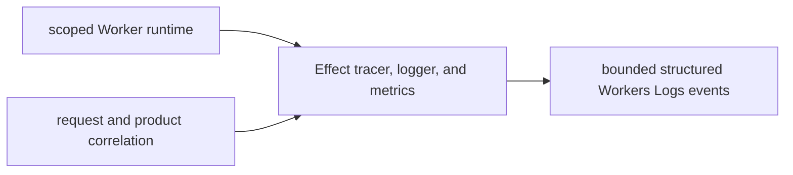

# observability

Workers-compatible Effect telemetry for Sketchi runtime boundaries.



| Owns                                           | Does not own                     |
| ---------------------------------------------- | -------------------------------- |
| scoped Effect telemetry resource lifecycle     | AI Gateway request logging       |
| bounded span, log, and metric events           | usage-event schemas or Pipelines |
| contextual correlation annotations             | R2 catalog or R2 SQL queries     |
| deterministic test sinks and metric registries | product payload capture          |

The live layer allocates an exporter inside an Effect scope and releases it when
the owning Worker runtime is disposed. It performs no module-scope I/O and starts
no timers. Exported annotations and fields use explicit allowlists; prompts,
artifacts, arbitrary causes, and other payloads are never serialized.

## Commands

```sh
pnpm nx test observability
pnpm nx typecheck observability
pnpm nx build observability
```
