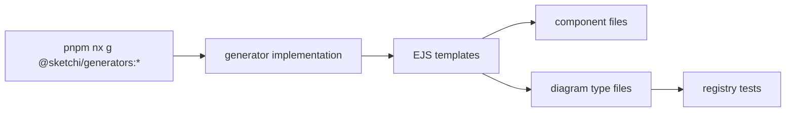

# sketchi-generators

Workspace Nx generators for Sketchi UI components and diagram types.



| Owns                                  | Does not own                     |
| ------------------------------------- | -------------------------------- |
| generator schemas and implementations | runtime diagram behavior         |
| UI component file templates           | component styling decisions      |
| diagram type scaffold templates       | final semantic diagram contracts |
| workspace export and coverage wiring  | app-specific route composition   |

## Commands

```sh
pnpm nx test sketchi-generators
pnpm nx typecheck sketchi-generators
pnpm nx build sketchi-generators
```

## Usage

Use these generators when adding owned workspace surfaces so tests, stories,
barrel exports, and registry coverage move together.

```sh
pnpm nx g @sketchi/generators:ui-component StatusBadge
pnpm nx g @sketchi/generators:diagram-type mindmap --title "Sketchi mindmap fixture"
```
